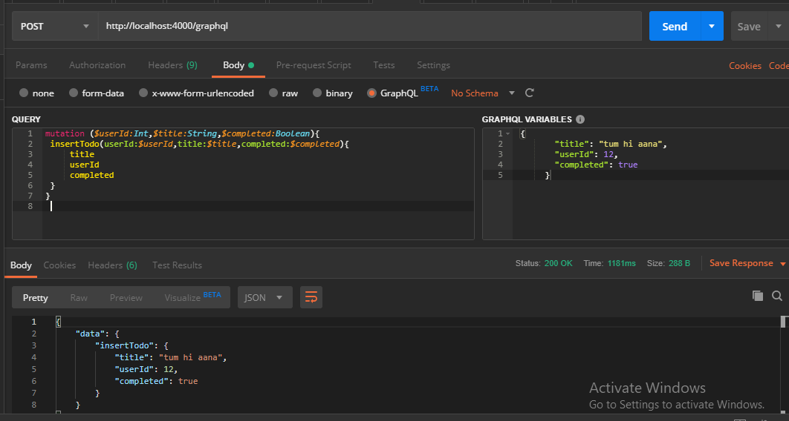

# learn graphql as fullstack developer

## in postman
- url : `http://localhost:4000/graphql` 
- url : `https://learngraphqls.herokuapp.com/graphql`
- Method : `POST`

*Query*
```bash
mutation ($userId:Int,$title:String,$completed:Boolean){
 insertTodo(userId:$userId,title:$title,completed:$completed){
     title
     userId
     completed
 }
}
 
```

*GRAPHQL VARIABLES*
```javascript
     {
        "title": "tum hi aana",
        "userId": 12,
        "completed": true
      }
```
*image*


****
*GetALL TODO*
*Query*
```bash
{
  todos {
    title
    id
    userid
    completed
  }
}


```
*result*
```javascript
{
  "data": {
    "todos": [
      {
        "title": "tum hi aana",
        "id": 1,
        "userid": 1,
        "completed": true
      },
      {
        "title": "hum to ",
        "id": 2,
        "userid": 2,
        "completed": false
      }
    ]
  }
}
```
****
*Get a specific TODO*
*Query*
```bash
query q($id: Int) {
  todoWithID(id: $id) {
    title
    id
    userid
    completed
  }
}
```

*Query variables*
*Query*
```bash
{
  "id": 1
}
```
*result*
```javascript
{
  "data": {
    "todoWithID": {
      "title": "tum hi aana",
      "id": 1,
      "userid": 1,
      "completed": true
    }
  }
}
```